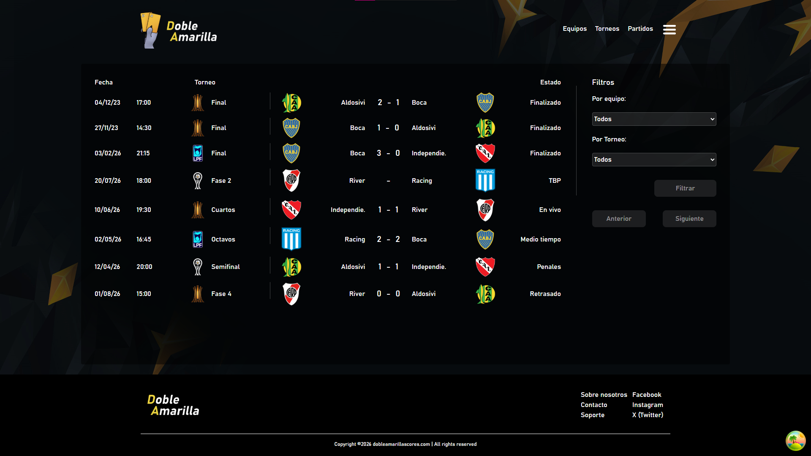
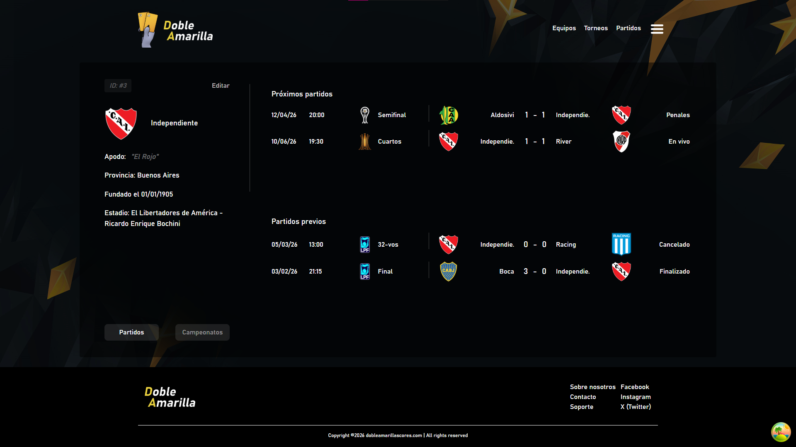
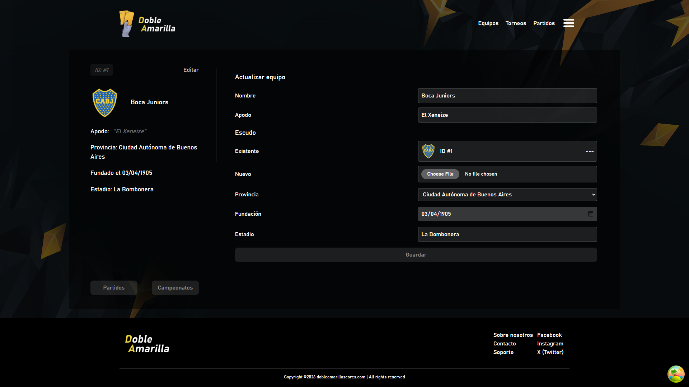

# DobleAmarilla Scores

Sistema interno de marcadores de torneos de futbol, desarrollado como proyecto de aprendizaje.  
Este proyecto esta estructurado como un monorepo que contiene su API backend y su cliente frontend.  

Objetivo: Afianzar conocimientos de desarrollo web aplicando arquitectura limpia y desacoplada.  

Estado: Beta (en desarrollo activo).  
Stack principal: Laravel (Backend API) | React.JS (Frontend SPA).  

## Estructura

/backend   -> Laravel REST API  
/frontend  -> React.JS Application  

